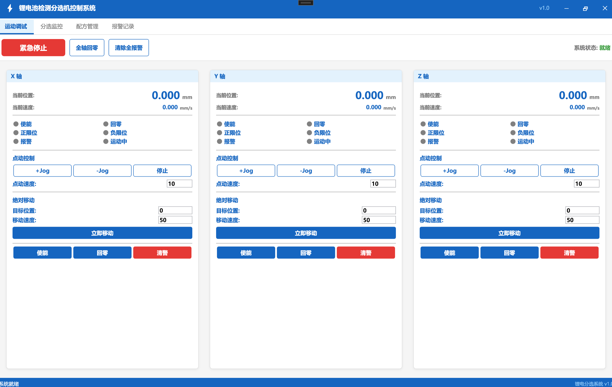
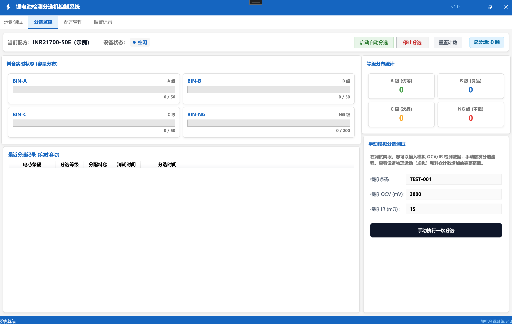
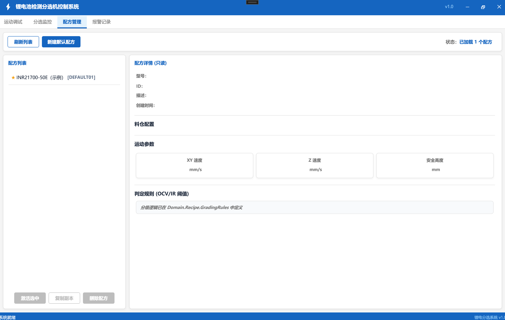
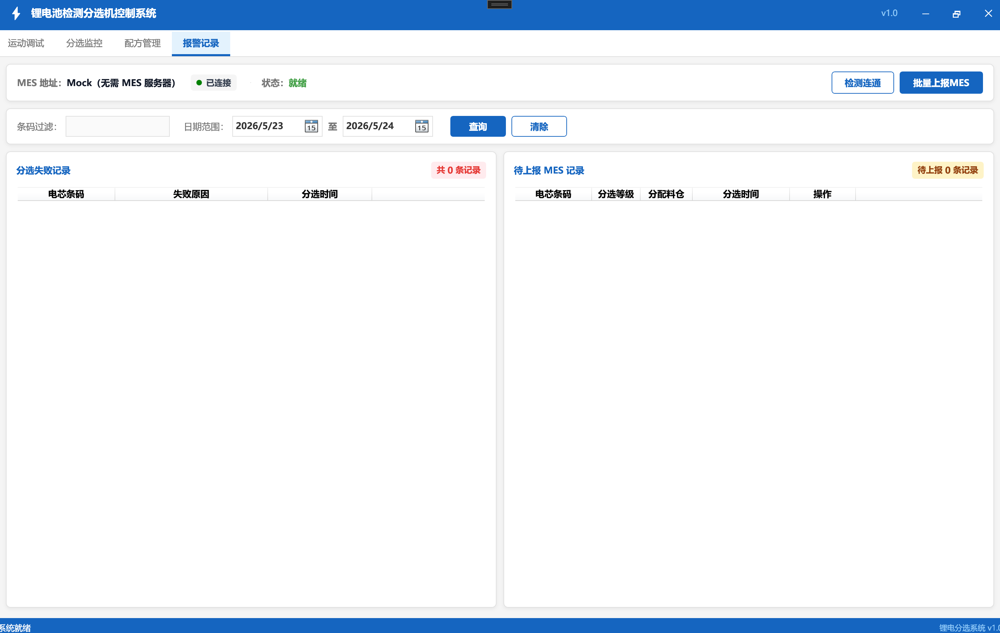
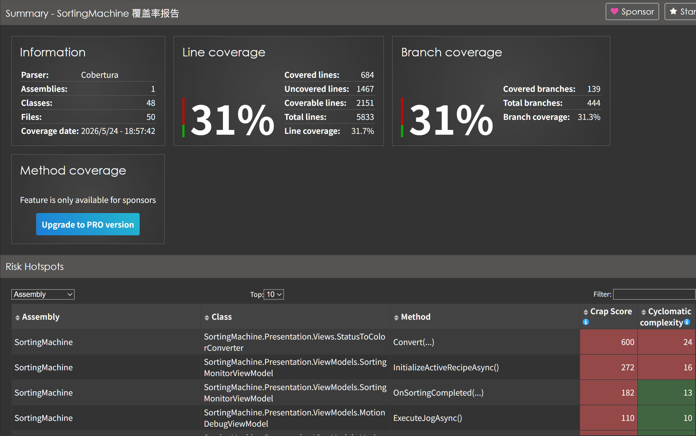

# 锂电池检测分选机运动控制系统

> 基于 WPF + Prism + .NET 8 的工业级运动控制上位机，用于锂电池电芯 OCV/IR 检测后的自动分选入仓。

[](https://dotnet.microsoft.com)
[](https://prismlibrary.com)
[](./SortingMachine.Tests)
[](./docs/screenshots/coverage-summary.png)
[](./LICENSE)

---

## 项目背景

本项目承接锂电后段 OCV/IR 检测工序，实现检测完成后电芯的自动分选入仓：

```
OCV/IR 检测结果 → 等级判定（A/B/C/NG）→ XY 龙门定位料仓 → Z 轴下降放料 → 数据追溯上报
```

**硬件目标：** 雷赛 EtherCAT 三轴（X 龙门横向 / Y 龙门纵向 / Z 吸嘴升降）

**当前状态：** 完整仿真层可在无硬件环境运行，预留雷赛/固高/ACS 适配接口

---

## 界面预览

### 运动调试页
三轴实时状态监控，支持点动、绝对移动、回零、急停



### 分选监控页
料仓容量实时显示，等级分布统计，支持手动触发模拟分选



### 配方管理页
多产品型号配方增删改查，料仓坐标与判级阈值管理



### 报警记录页
分选失败记录追溯，MES 批量上报与单条重传



### 测试覆盖率报告
覆盖率统计包含 Domain + Infrastructure 核心业务层，Presentation 层（WPF ViewModel/View）未计入。



---

## 技术栈

| 层级       | 技术选型                       | 说明                                  |
| ---------- | ------------------------------ | ------------------------------------- |
| UI 框架    | WPF + Prism 9 + MVVM           | 模块化解耦，ViewModelLocator 自动绑定 |
| 运动控制   | 接口抽象 + Mock 仿真           | 预留雷赛 EtherCAT SDK 适配            |
| 状态机     | Stateless 5.x                  | 声明式状态转换，非法跃迁自动拦截      |
| 数据持久化 | FreeSql + SQLite               | 配方 JSON 列存储 / 日志规范化列存储   |
| 测试框架   | xUnit + Moq + FluentAssertions | Abstract Base Class 契约测试模式      |
| 运行时     | .NET 8 / C# 12                 | 全异步 async/await，无同步阻塞        |

---

## 架构设计

```
SortingMachine/
├── Infrastructure/              # 驱动层（硬件抽象）
│   ├── Motion/
│   │   ├── IMotionController    # 厂商无关接口
│   │   ├── MockMotionController # 无硬件仿真实现
│   │   └── AxisDefinition       # AxisId 强类型枚举
│   ├── IO/                      # DI/DO 封装
│   └── Persistence/             # FreeSql 仓储实现
│       ├── SortingLogRepository
│       └── RecipeRepository
│
├── Domain/                      # 业务核心
│   ├── StateMachines/
│   │   ├── HomingStateMachine   # 回零状态机（Stateless）
│   │   └── ISafetyValidator     # 安全校验接口
│   ├── Recipe/                  # 配方领域模型
│   ├── SortingService           # 分选调度核心
│   └── SortingLog               # 追溯日志模型
│
├── Application/                 # 应用服务层
│   └── AppModule                # Prism 模块 + DI 注册
│
└── Presentation/                # WPF 表现层
    ├── Views/                   # 四 Tab 视图
    │   ├── MotionDebugView      # 运动调试
    │   ├── SortingMonitorView   # 分选监控
    │   ├── RecipeView           # 配方管理
    │   └── AlarmLogView         # 报警记录
    └── ViewModels/              # Prism BindableBase ViewModel
```

---

## 核心工程亮点

### 1. 驱动层接口隔离

```csharp
// 业务层只依赖接口，不感知任何硬件厂商
public interface IMotionController
{
    Task<MotionResult> MoveAbsoluteAsync(AxisId axis, double position,
        double velocity, CancellationToken ct = default);
    Task<MotionResult> EmergencyStopAsync();
    event EventHandler<AxisStatusChangedEventArgs> AxisStatusChanged;
    // ...共 16 个方法 + 2 个事件
}

// 切换雷赛驱动：只需新增实现类，上层零改动
// containerRegistry.RegisterSingleton<IMotionController, LeadshineController>();
```

业务错误用 `MotionResult` 返回值传递，不用异常——硬件频繁报警是"正常"的业务路径，异常链路会让日志完全不可读。

### 2. 回零状态机（Stateless 库）

Z → X → Y 强制顺序，Z 轴先回零确保吸嘴缩回安全高度，避免横移时碰撞料仓。

```csharp
_machine.Configure(HomingState.HomingZ)
    .Permit(HomingTrigger.ZHomed,     HomingState.HomingX)
    .Permit(HomingTrigger.AxisFailed, HomingState.Failed)
    .Permit(HomingTrigger.Cancel,     HomingState.Cancelled);
```

非法状态跃迁（如 Idle → Completed）在配置阶段即被拦截，无需手写校验。

### 3. 两层安全保障

```
第一层：ISafetyValidator（运动前静态校验）
  - 软限位检查
  - Z 轴安全高度联锁（Z > 10mm 时拒绝 XY 大范围移动）
  - 报警互锁
  - Jog 近限位预判（距限位 5mm 内提前拒绝，不等硬限位触发）

第二层：运动序列约束（SortingService 硬编码顺序）
  Z 抬起 → XY 定位 → Z 下降 → 放料 → Z 抬起
  任何步骤失败 → 立即 EmergencyStopAsync
```

### 4. 双模式数据存储

| 数据类型            | 存储策略              | 原因                                         |
| ------------------- | --------------------- | -------------------------------------------- |
| 配方 SortingRecipe  | JSON 列（整条序列化） | 配方是原子单元，整体切换，不需跨配方聚合查询 |
| 分选日志 SortingLog | 规范化列              | 需要按等级/时间统计，GROUP BY 查询必须规范化 |

### 5. 契约测试架构

```csharp
// Abstract Base Class 模式：接口契约和实现测试分离
public abstract class MotionControllerContractTests
{
    protected abstract IMotionController CreateController();

    [Fact] public async Task EnableAxis_WhenInitialized_ShouldSucceed() { ... }
    [Fact] public async Task HomeAllAxes_ShouldFollowZXYOrder() { ... }
    // 定义 30+ 条行为契约
}

// 当前：Mock 实现
public class MockMotionControllerTests : MotionControllerContractTests
{
    protected override IMotionController CreateController() => new MockMotionController();
}

// 未来：接入雷赛，同一套契约自动覆盖真实驱动
// public class LeadshineControllerTests : MotionControllerContractTests { ... }
```

---

## 快速开始

### 环境要求

- .NET 8 SDK
- Windows 10/11（WPF 依赖）
- Visual Studio 2022 或 Rider

### 运行步骤

```bash
# 克隆仓库
git clone https://github.com/Jayla630/SortingMachine.git
cd SortingMachine

# 构建
dotnet build SortingMachine.sln

# 运行（无需任何硬件，全仿真模式）
dotnet run --project SortingMachine/SortingMachine.csproj
```

### 运行测试

```bash
dotnet test SortingMachine.sln
# 预期输出：139 passed, 0 failed, 0 skipped
```

---

## 使用说明

1. **运动调试 Tab**：点击各轴 [使能] → [全轴回零]（约 6 秒完成，Z 轴先动）
2. **配方管理 Tab**：点击默认配方 → [激活]（出现 ★ 标记）
3. **分选监控 Tab**：输入模拟 OCV/IR 数据 → [手动执行一次分选]
4. **报警记录 Tab**：查看分选失败记录，点击 [批量上报 MES] 触发模拟上报

> **注意：** 分选操作需先完成使能 + 回零，`SortingService.IsReadyAsync()` 校验三轴状态后才允许执行。

---

## 测试覆盖

| 测试模块                      | 用例数  | 覆盖场景                            |
| ----------------------------- | ------- | ----------------------------------- |
| MotionControllerContractTests | 23      | 使能/回零/运动/急停/事件/取消       |
| HomingStateMachineTests       | 21      | 状态转换/前置校验/回零顺序/故障注入 |
| SafetyValidatorTests          | 16      | 软限位/Z轴联锁/报警联锁/Jog预判     |
| GradingRulesTests             | 15      | NG/A/B/C 边界值完备覆盖             |
| SortingServiceTests           | 30      | 分选流程/运动顺序/并发保护/料仓满料 |
| SortingLogRepositoryTests     | 20      | SQLite 持久化/查询/统计/MES标记     |
| MesUploadServiceTests         | 14      | 批量上报/单条重传/MarkAsUploaded    |
| **合计**                      | **139** | **0 failed**                        |

---

## 路线图

- [x] 驱动抽象层 + MockMotionController 仿真
- [x] 回零状态机（Stateless）+ 安全校验器
- [x] 分选业务核心（判级 + 运动序列 + 料仓管理）
- [x] 配方系统（FreeSql + SQLite 持久化）
- [x] 分选日志追溯 + MES 批量上报
- [x] WPF 四 Tab UI + 统一设计系统
- [x] 139 条 xUnit 测试全绿
- [ ] 雷赛 EtherCAT SDK 适配层（LeadshineController）
- [ ] Serilog 文件日志 + 滚动归档
- [ ] 自动运行节拍调度（连续分选模式）

---

## 许可证

MIT License © 2026 Jayla630
